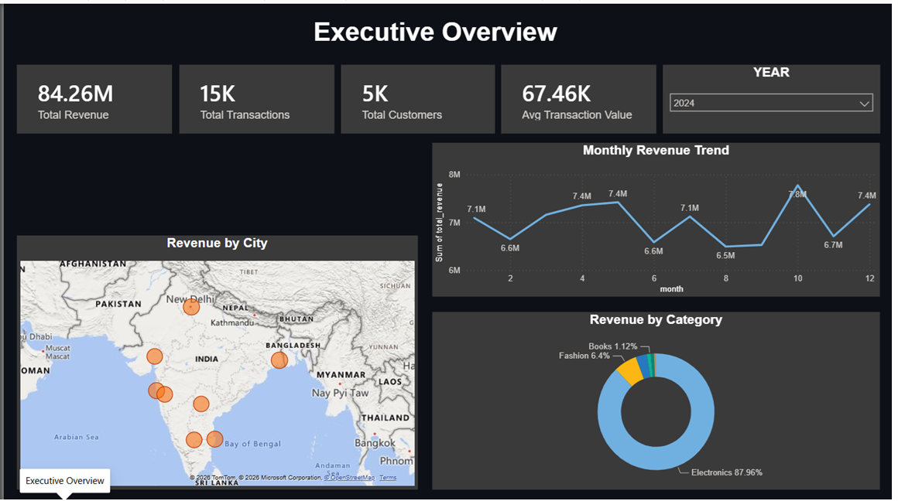
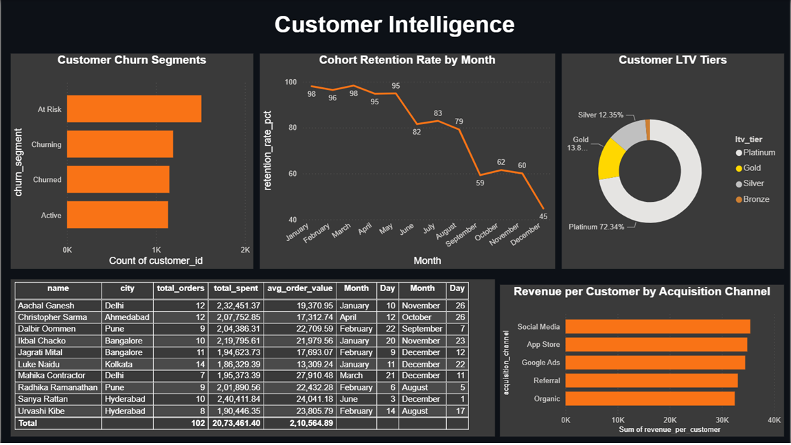
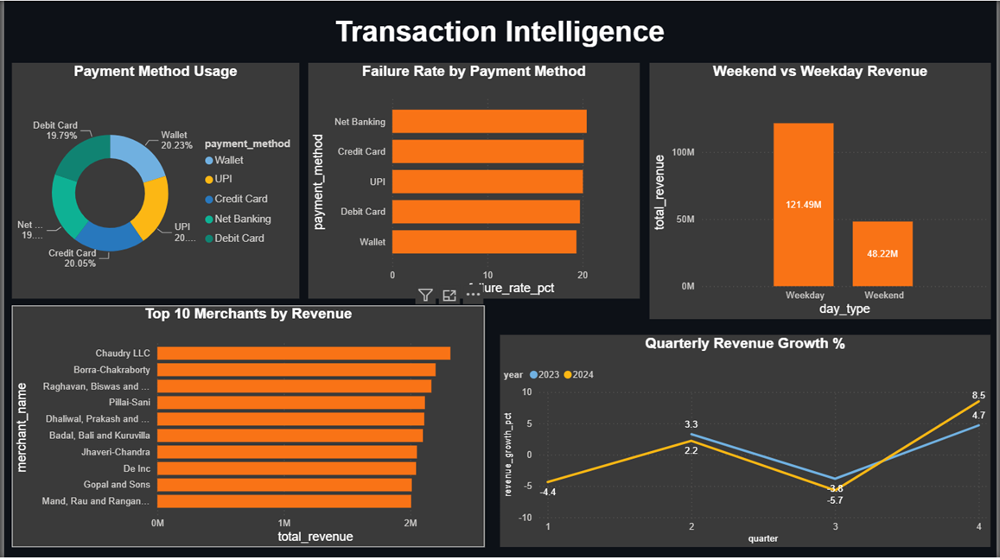
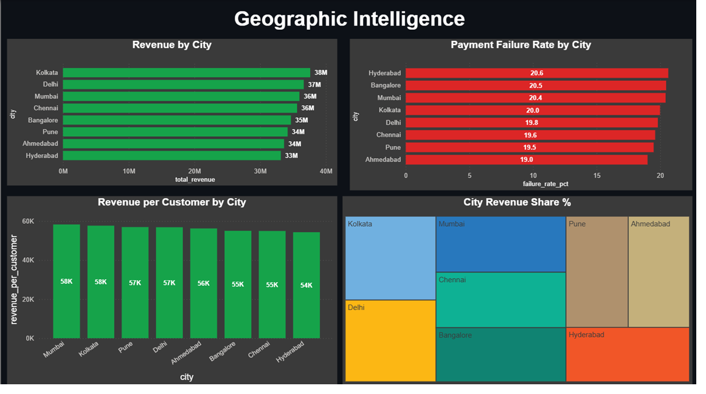

# Customer Analytics Data Warehouse

An end-to-end customer analytics system built on a PostgreSQL star schema warehouse, 
a 12-view SQL analytics layer, and a 4-page Power BI dashboard — modeled after 
real-world fintech data infrastructure.

---

## Project Architecture

Python (Data Generation)
↓
PostgreSQL Star Schema (5 tables, 50,000 transactions)
↓
SQL Analytics Layer (12 views)
↓
Power BI Dashboard (4 pages, 17 visuals)

---

## Dashboard Pages

### 1. Executive Overview
KPI cards, monthly revenue trend, revenue by category, city-level map.

### 2. Customer Intelligence
LTV tier segmentation, churn analysis, cohort retention, acquisition channel performance, top 10 customers.

### 3. Transaction Intelligence
Payment method usage, failure rates, weekend vs weekday spend, quarterly revenue growth, top merchants.

### 4. Geographic Intelligence
City-level revenue, revenue per customer, payment failure rate by city, revenue share treemap.

---

## Database Schema

**Fact Table**
- `fact_transactions` — 50,000 rows, 2 years of transaction data (2023-2024)

**Dimension Tables**
- `dim_customer` — 5,000 customers across 8 Indian cities
- `dim_product` — 16 products across 6 categories
- `dim_merchant` — 100 merchants
- `dim_date` — full date dimension with quarter, weekend flag

---

## SQL Analytics Layer — 12 Views

| View | Business Question |
|------|------------------|
| vw_monthly_revenue | How is revenue trending month over month? |
| vw_revenue_by_category | Which product categories drive the most revenue? |
| vw_top_customers | Who are our highest value customers? |
| vw_churn_segments | Which customers are at risk of churning? |
| vw_customer_ltv | What is each customer's lifetime value and tier? |
| vw_acquisition_channel | Which channel brings the most valuable customers? |
| vw_payment_analysis | Which payment methods fail the most? |
| vw_weekend_vs_weekday | When do customers spend the most? |
| vw_top_merchants | Which merchants drive the most revenue? |
| vw_quarterly_growth | What is our quarter over quarter revenue growth? |
| vw_cohort_retention | How well do we retain customers over time? |
| vw_city_revenue | Which cities generate the most revenue per customer? |

---

## Key Insights

- **Electronics dominates at 87% of revenue** — high ticket size drives disproportionate revenue; concentration risk worth monitoring
- **Weekday revenue is 2.5x weekend** — 5 weekdays vs 2 weekends; per-day average is nearly equal
- **Hyderabad has the highest payment failure rate at 20.6%** — warrants investigation into regional banking or network issues
- **Cohort retention drops steeply after month 6** — a targeted retention campaign at the 6-month mark could recover significant revenue
- **Social Media brings the highest revenue per customer** — suggests budget reallocation from lower-performing channels

---

## Tech Stack

- **Python** — data generation (Faker, Pandas, SQLAlchemy)
- **PostgreSQL** — data warehouse and star schema design
- **SQL** — 12 analytical views using window functions, CTEs, cohort analysis
- **Power BI** — 4-page interactive dashboard

---

## How to Run

1. Run `generate_data.py` to generate and load data into PostgreSQL
2. Execute `Customer_Analytics.sql` to create views
3. Open `PROJECT C.pbix` in Power BI Desktop
4. Connect to your local PostgreSQL instance

---

## Screenshots

### Executive Overview

### Customer Intelligence

### Transaction Intelligence

### Geographic Intelligence

